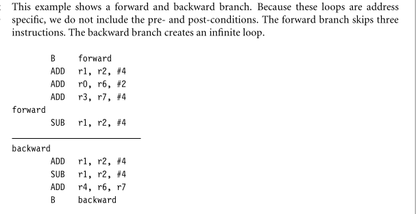

# Module 1
```Textbook 1: Chapter 1 - 1.1 to 1.4, Chapter 2 - 2.1 to 2.5```
## 1.1 The RISC Design Philosophy
The ARM core(a successful componenent of many successful 32 bit embedded systems widely used in portable devices.) uses a RISC architecture.
RISC architecture provides simple but powerful instructions that executes withing a single cycle  at high clock speed.It places a greater demands on the compiler because there are reduced instructions used to avoid the complexity and provide greater flexibitly and intelligence in software rather than hardware In contrast CISC relies more on the hardware for instructions
The RISC philosophy is implemented iwht four major design rules:
1. Instructions
2. Pipelines
3. Registers
4. Load-Store architecture.
- Instructions: has reduced nmber of instruction classes
  -these classes provide simple operation that can each execute in a single cycle
  - each instruction is of fixed length to allow the pipeline to fetch future instructions before decoding the current instructions
  - In CISC, instructions are of variable size and take many cycles to execute.
- Pipelines: the processing of instructions are broken down into simpler units that can be executed in parallel by piplelines.
  - ideally the pipeline advances by one step each cycle for maximum throughput.
  - instructions can be decoded in one  pipeline stage therefore there is no need for an instruction to be executed by a miniprogram called **microcode** as on CISC processors.
- Registers: RISC have large general purpose register set.
  - it can contain either data or address.
  - it acts as fast local memory store for all data processing operations in contrast CISC have dedicated registers for specific purposes.
- Load-Store Architecture: operates on data held in registers.
  - seperate load and store instructions transfer data between the register bank and external memory
  - Accessing memory is costly so seperating memory accesses from data processing provides an advantage because you can use data items held in the register bank multiple times without needing multiple memory accesses. In contrast CISC design the data processing operations can act on memory directly
- these design rules allow the RISC processor to be simpler and thus the core can operate at higher clock frequencies.
- CISC : more complex and operate at lower clock frequencies.

## 1.2 The ARM Design Philosophy
- Battery: designed to be small to reduce power consumption and extend battery operation for mobiles, and personal digital assistants.
- High Code Density: since it has limited memory due to costand physical restrictions. and its useful for applications  that have limited on-board memory
- Price Sensitive and use low-cost memory devices.
1. **Instruction Set for Embedded Systems**
the ARM IS differs from pure RISC definition to make it suitable for Embedded Systems.
- Variable cycle execution for certain instructions i.e not every instruction executes in a single cycle.
- Inline barrel shifter leading to more complex instructions: The inline barrel shifter is a hardware  componenet that preprocesses one of the **input registers** before it is used by an instruction. this improves core performance and code density.
- Thumb(16-bit instruction set): a second 16-bit instruction set that permits the ARM core to execute either 16 or 32 bit instructions this improves code density by about 30% over 32bit fixed length instructions.
- Conditional execution: a instruction is executed only when a specific condition has been satisfied.
- Enhanced execution: DSP(Digital Signal Processor ) were added in ARM instruction set to support  faster operations
## 1.3 Embedded System Hardware
embdedded systems can control many different devices from small sensors to NASA satelites.

- ARM processor: controls the embedded device. it comprises of core surrounded by components that interface it with a bus
- Controllers: coordinate imp. functional blocks of the system two imp. controllers are intpt. and memo. controllers.
- Peripherals: provide I/O device , exteternal devices.
- Bus: used to communicate btw different parts of the device.
1. **ARM Bus Technology**
ESystems use diff bus tech. than those designed for x86 PCs. the most common one is PCI(Peripheral Component Interconnect ) which is used in x86 PCs and these are connected externally
- In contrast Embedded Systems use  an on-chip  bus that is internal to the chip and that allows different  peripheral devices  to be interconnected within the ARM core.
- there are two classes attaced to the bus
  1. The ARM processor core is a *bus master* -- a locial device capable of initiating a data transfer with another devie across the same bus
  2. Peripherals tend to be *bus slaves*  -- logical device which is capable of responding to the transfer requests from Bus master.
- A bus has two architecture levels
  1. Physical level : covers the electical characteristics and bus width(64 bits)
  2. Protocol level: deals with protocols -- the logical rules  that govern the communication between the  processor and a peripheral.
2. **AMBA Bus Protocol (Advanced Microcontroller Bus Architecture**
- using AMBA peripheral designers can reuse the same design on multiple projects. because,there are large number of peripherals developed with an AMBA interface, a peripheral can be bolted onto the on-chip bus without having to redesign a interface for eace diff. processor - the pulug and play interface improves availability and time to marke
- AHB(ARM High Perf. Bus):provides high throughput because of its centralised architecture. and it allows single bus  master to be active on the bus anytime.
3. **Memory**
  1. Hierarchy:
    - cache which is the fastest is near to the ARM core(between main memory and core) and secondary memory which is the slowest is set farther away.
  2. Width: the no. of width is the number of bits the memory returns on each access example: 8,16,32 bits.
  - it has direct effect on the overall perf. and cost ratio.
  3. Types
    - ROM is the least flexible of all memo. types it contains image that is permanently set at production time and cannot be reprogrammed
    - FROM(Flash): can be written and read but slow to write  so it's not used for storeing dynamic data.
    -DRAM(Dynamic): is the most common; lowest cost per MB
    - SRAM(Static): faster than more traditional DRAM. but requires more silicone Area it's static i.e the RAM doesn't require refreshing. the access time for SRAM is considerably shorter.
    -SDRAM(Synchronous Dynamic):can run at higher clock speed.
4. **Peripherals**
a peripheral is a device that performs input and output functions for the chip by connecting to oterh devices or sensors. that are off-chip.
- these are memory mapped
- Controllers are specialized peripherals that implement higher levels of functionalities there are two important types of controllers they are
  1.**Memory Controllers**(connect different types of memory to the processor bus)
  2. **Interrupt Controllers**(when a peripheral or device requires attention. it raises an interrup to the processor)
## 1.4 Embedded System Software.

- the initialization code is the first code executed onthe board and is specific to a particular target or group of targets.
- The OS provides an infrastructure to control applications and manage hardware system resources 
- Device Drivers: they provide consistent software interface to the peripherals on the hardware device 
- Application : performs one of the taks rerquried for a device
## 2.1 Registers
General purpose registers hold either data or address. ex r1,r34 etc.

all the registers are of 32 bit size.
- there are 18 active registers :16 data registers and 2 processor status registers
- Data registers : r0 to r15
- Special Purpose Register: r13 --> stack pointer(sp), r14--> link register(lr),r15--> program counter(pc)
- Depending ont he situations special purpose registers can also be used as gen. purpose registers.
## 2.2 Current Program Status Register
cpsr : used to monitor and control internal operations , the cpsr is the 32 bit register that resides in register file
- cpsr is divided into four fields(each of 8 bit)
  - flag(contains conditional flags)
  - status(reserved for future use)
  - extension(reserved for future use)
  - control(contains processor mode, state and interrupt mask bits)
  
1. **Processor Modes**
- determines which registers are active and the access rights to the cpsr register itself
- each processor mode is either : 1. privileged(both read and write) 2. non-previleged( allows only read to control field but still  allows read and write for conditional flags)
- there are seven processor modes in total (6 previleged modes + 1 non-previleged mode i.e user mode)
  1. abort -- when there is a failed attempt to acces memo.
  2. fast interrupt request -- corresponds to two interrupt levels available in ARM processor.
  3. interrupt request -- same as above
  4. supervisor -- mode that the processor is in after reset and kernel generally operates in this mode.
  5. system -- special version of user mode that allows full read and write access to cpsr.
  6. undefined -- processor encounters an instruction that is undefined or not supported by implementation
  7. user ( non privileged mode) -- used for programs and applications 
2. **Banked registers :**
 are hidde (shaded in fig.) they are activated only when processor is in any mode.
 
## 2.3 Pipeline
 A pipeline is a mechanism a RISC processor uses to execute instructions . Using pipleline speeds up execution by fetching the next instruction while other instructions are begin decoded and executed.
 - three stages of pipeline
 
1. **Pipeline Executing Characteristics**
- ARM pipline has not processed an instruction until it passes completely through the execute stage  for example in three stages its executed only when the fourth instruction is fetched 

- the execution of a branch instruction or branching by the direct modification of the pc coauses the ARM core to flush its pipeline.
- ARM10 uses branch prediction, which reduces the effect of a pipleline flush by possib. branches and loading the new branch address prior execution of instructions.
- an instruction in the execute stage will complete even through an interrupt has been raised , other instruction in the pipeline will be abondaned and the processor will start filling the pipeline from the appropriate entry in the vector table
## 2.4 Exception, Interrupts and Vector Table
 whena a execption or interrupt occurs the processor sets the pc to a specific memory address. the address is withinig a special address range called **vector table**
 - whena a interrupt/exception occurs the processor suspends normal execution and starts loading instructions  from exception vector table 
 - each vector table entry contaisn a form of branch instruction pointing to  the start of a specific routine:
  - Reset Vecor: location of vector when first power is applied 
  - Undefined  Vector : used when the processor cannot decode an instruction
  - S/W interrupt vector: when SWInterrupt is executed
  - Prefetch abort vector: try to fetch an instruction from an address without the correct access witihout the correct access permissions 
  - Data abort vector : similar to prefetch abort but is raised when an instruction attempts to access data without permissions.
  - Interrupt req. vector: used by external hardware to interrupt the normal execution flow of the processor ,it can only by raised if IRQs are not masked in the cpsr.
  - Fast Interrupt Request vector: similar to interrupt request but is reserved for hardware requiring faster response times.
  ## Core Extensions
  these are standard components place dnext to the ARM core. they imporve performance, manage resources and provide extra functionality  and are desigend to provide flexibitlity in handling particular applications 
  - there are three hardware extensions ARM wraps around the core:
    1. cache and tightly coupled memory
    
    2. Memory Management(no extensions providin protection ,2. MPU -- Memory Protection Unit-- partial protection 3.(MMU) Memory Management Unit -- provides full protection)
  -------
  # Module 2
  ```Textbook 1: Chapter 3 - 3.1 to 3.6```
  ## 3.1 Data Processing Instructions
  the data processing instructions manipulate data within registers. they are **move** instructions **arithmatic instructions**, **logical instructions** etc most data processing instructions can process one of their operands using barrel shifter.
  1. **MOVE INSTRUCTIONS**
  is the simplest ARM isntruction. it copies N into a destination register Rd, where  N is a register or immediate value.
  - Syntax: instruction[cond]{S} Rd,N
   Ex: MOVE Rd,N ( moves a 32 bit value into a register )
      MVN Rd,N (moves the NOT of the 32 bit value into a register)
2. **Barrel Shifter**
 In the example MOVE Rd,N; here N is a simple register but it can be more than just a register or immediate value ; it can also be register Rm that has been preprocessed by the barrel shifter prior to begin used by a data processing instruction
 - Data Processing instructions are processed withing ALU.
 - A unique and powerful feater of ARM processor is to shift the 32 bit bin. pattern in one of the source registers left or right by a specific number of positions before it enters the ALU. this shift increases the power and flexibility of many data processing operations .
 - Pre-processing or shift occurs within the cycle time of the instruction. this is particularly useful for loading constants into a register and achieving fast multiples or division by the power of 2.
 
 ```
  MOV r7,r5,LSL #2
  POST r5=5
      r7=20
 ```
 
 3. **Arithmetic Instructions**
 implement addition and subtraction fo 32 bit signed and unsigned values.
 
 4. **Arithmetic Instructions can also used with barrel shifter**
 5. **Logical Instructions**
 
 6. **Comparison Instructions**
 used to compare or test a register witha 32 bit value. they update cpsr flag bits according to the result but don't affect other registers.
 
 7. **Multiply Instructions**
 the multiply instructions multiply the contents of a pair of registers and depending upon the instruction is a logical AND operation and TEQ is a logical exclusive OR operation.
 
 ## 3.2 Branch Instructions
 A branch instruction changes the flow of execution or is used to call a routine . this type of instruction allows programs to have sub routines, if-then-else structures and loops
 
 
 ## 3.3 Load-Store Instructions
 transfers data between memory and processor registers
 - there are 3 types of l-s instructions 
  1. Single-Register Transfer
  2. Multiple Register Transfer
  3. Swap
1. **Single Register Transfer**
these are used for moving a single data item in and out of a register. the datatypes supported are signed, unsigned,32,16 and bytes.

2. **Mulitiple Register Transfer**
can transfer multiple registers between meomoryand the processor in a single instruction. the transfer occurs froma a base address register Rn pointing into memory. Multiple register transfer instructions are more efficient from single-register transfer for moving blocks of data around memory and saving and restoring eht contents and stack.  

- The load store multiple instructions used to carry out stack operations also
3. **Swap Instruction**
this instruction is a special case of a load store instruction . it swaps the contents of memory with the contents of register

## 3.4 Software Interrupt Instruction
a software interrupt instruction (SWI) causes a software interrupt exception , which provides a mechanism for applications to call OS routines.

## 3.5 Program Status Register Instructions
the ARM instruction set provides two instructions to directly control a program status register(psr).
- the MRS instruction transfers the contents of a register into the cpsr or spsr
1.**Coprocessor Instructions**
are used to extend the instructin set. A coprocessor can either provide additional computation cpability or be used to control the memory sybsystem processing , register transfer instructions 

2. **Coprocessor  15 Instruction Syntax**
CP 15 configures the processor core and has a set of dedicated registers to store configuration information . a value written into a register sets a configuration attribute for example : switching on a cache.
## 3.6 Loading Constants
there is no ARM instruction to move a 32 bit constant into a register . Since ARM instrucion are 32 bit in size they obiviosly can't specify a general 32 bit constant .
Syntax : LDR Rd , constant ; ADR Rd, label
- MOV and MVN Instructions: These instructions can be used to load many commonly used constants. The assembler can automatically choose the correct instruction based on the constant's representation. If a constant cannot be constructed using MOV or MVN, an error will be reported
- LDR with PC-relative Addressing: A common approach to load larger constants is to use the LDR instruction with a PC-relative address. This involves placing the constant in a literal pool, which is a section of memory that holds constants. The instruction format typically looks like this:

```
  LDR r0, [pc, #offset]
```
---------------


# Module 5
- Caches
``` Textbook 1: Chapter 12.1 to 12.4 ```
A cache is a small fast array of memory placed between the processor core and main memory that store portions  of recently referenced main memory . the processor uses cache memory instead of meain meory whenever possible to increase system performance. the goal of cache is to reduce the meory access bottleneck imposed on the processor core by slow memory. Often used with a cache is a write buffer—a very small first-in-first-out (FIFO) memory
placed between the processor core and main memory. The purpose of a write buffer is to
free the processor core and cache memory from the slow write time associated with writing
to main memory.
## 12.1 The Memory Hierarchy and Cache Memory
- the innermost level of hierarchy is  the processor core . the memory is so tigthtly coupled to the processor  that in many ways its difficult to think of it as seperate from the processor. and this memory is register file.
- at the primary level  memory components are connected to the processor core through dedicated  on chip interface also there is main memory at the primary level
- at the secondary level secondary storage - large , slow , relativley inexpensive mass storage  devices . it is used to store unused portions of very large programs that do not fit in main memory
- A cache may be incorporated between any level in the hierarchy where ther is a significant access time difference between memory components. a cache can imporve system performance  whenever such difference exists 

1. **Caches and Memory Management Units**
if a cached  core suports virtual memory then it can be located between the core and the memory management unit (MMU) and physical memory.
- A logical cache store data in vitual address space. and its located between MMU and processr
- A physical cache stores  memory using physical address. and its located between MMU and main meory

## 12.2 Cache Architecture
- In the processor using the Von-Neuman architecuture there is single caceh used for instruction and data.this type of cache is called as unified cache. and it contains both instruction and data values.
- In processor using Harvard Architecture  there are two caches: an instruction cacle (I cache ) and a data cache ( D-cache ) this type of cache is known as split cache
1. **Basic Cache Architecture**
has three main parts :
  1. Directory store ( to hold the address identifying where the cache line was copied  from main memo. )
  2. Data Section (the data read from the main meory is held here )
  3. Status Information all thse of the cache memory are present for each cache line (status bits are sotred here )
  
2. **Basic Operation of Cache Controller**
Cache controller is a hardware that copies code or data from main memo to cache memory automatically
- it intercepts read and write memory requests before passing them on to the memoyr controller.
- first , the controller uses the set index portion of the address to locate the cache lines within the cache memory. that might hold the requested data. this cache line contains the cache tag and status bits 
- then it checks the valid bit to determine if the cache line is active and compares the cache tag to the tag field of the req. address. if both the status check and comparison succeed it is a cache hit. else its a cache miss.
- on cache miss , the controller copies an entire cache line from main meory to cache memory and provides req. code or data to the processor  this is called cache line fill.
- on cache hit the controlelr supplies the code or data directly from cache memory to  the processor , to do this it moves to the next step. which is to use the data index field of the address request to select the actual code or data in the cache line and provide it to the processor.
3. **Relationship between cache and main memory.**
In a directed mapped cache  each addressed location in main memory maps to single location in cache memory since mainmemory is larger that cache sometimes multiple address locate to same address in cache memory

the direct mapped cache is simple soltuion bu there is a desgin cost inherent in having a single location available to store a vlue from main meory.
- DM are subject to high level thrashing 
4. **Set Associativity**
these are additional desing feature to reduce the frequency of thrashing  here the Cache memo. is divided into simple units called ways is still a 4 KB cache. however the set index ins not address more than one cache line - it pints to one cache line in each way

**Associative cache**
any main memory block can mapped into any cache line main memory address is divided into two groups which are tags and word bits. words are low - order bits and identifies the location of a word within a block and tags are high -order bits which identifies the block

if a miss occur CPU bring the block from the main memory to the cache if there is no free block in the corresponding set it replaces a block and put the new one 
Disadvantages are : high cost of implementation
5. **Write Buffer**
```
+-------------------+
|       CPU         |
+-------------------+
         |
         | Write Request
         |
+-------------------+
|   Write Buffer    |
+-------------------+
|   Data Storage    |
+-------------------+
         |
         | Write to Memory
         |
+-------------------+
|     Main Memory   |
+-------------------+
 Measuring Cache Efficiency
  hit rate =
(cache hits/
memory requests)× 100
```
## 12.3 Cache Policies 
1. replacement policiy
2. write policy
3. allocation policy 

1. Replacement Policy
  Cache line replacement policies determine which cache line to evict when a cache miss occurs and the cache is full. Here are the main cache line replacement policies:

## First-In-First-Out (FIFO)

In FIFO, the cache line that has been in the cache for the longest time is evicted first. It operates like a queue where the oldest line is at the head and the newest line is at the tail. On a miss, the line at the head is evicted and the new line is added at the tail.

## Least Recently Used (LRU) 

LRU evicts the cache line that has not been accessed for the longest time. It assumes that recently accessed lines are likely to be accessed again soon. LRU keeps track of the access order of lines and evicts the line that was accessed farthest in the past.

## Least Frequently Used (LFU)

LFU evicts the line that has been accessed the least number of times. It maintains a counter for each line indicating the access frequency. The line with the smallest counter value is evicted on a miss.

## Random Replacement (RR)

Random replacement evicts a random cache line when a miss occurs. It is simple to implement but does not consider access patterns.

## Pseudo-LRU (PLRU)

Pseudo-LRU approximates true LRU by tracking the relative order of lines using a binary tree. It requires fewer bits per set compared to true LRU.

The choice of replacement policy depends on factors like implementation complexity, performance, and the expected access patterns of the workload. LRU is commonly used as it provides a good balance of performance and cost, while FIFO and random are simpler to implement in hardware.


